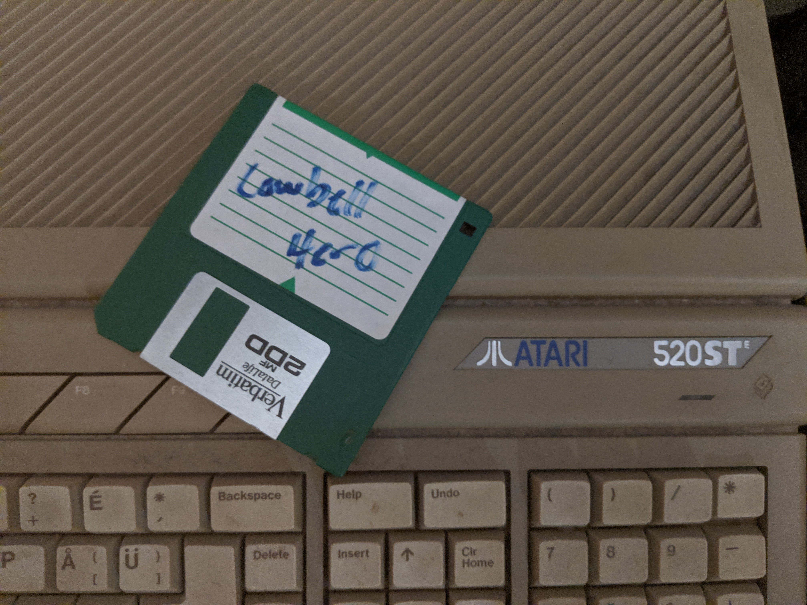
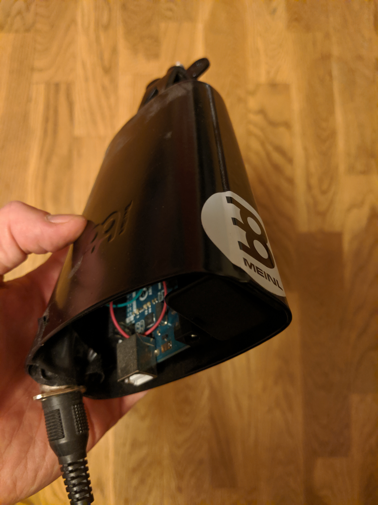

# Cowbell Hero

The game to get for your midi-converted cowbell!

## How to run

Load [COWBELL.GFA](COWBELL.GFA) in GFA Basic 3.5, press run.

## How to play

Plug your midi-converted cowbell into the midi port, then bang on it as Bruce Dickinson (yes, _the_ Bruce Dickinson) flies across the screen.

The aim of the game is to keep his fever down, and the only cure is: MORE COWBELL.

## Midi cowbell

A piezo element, an arduino and a midi port. And some code that is long lost.

